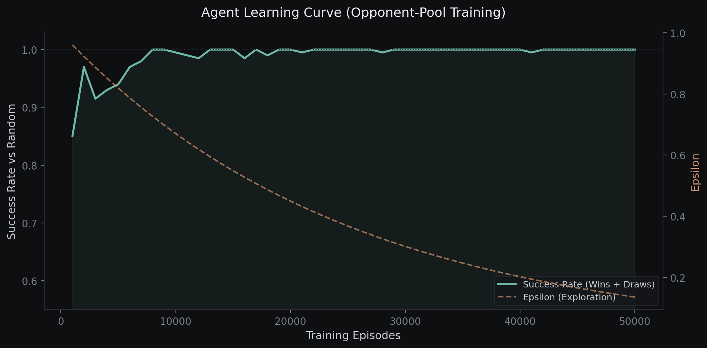

# Tic-Tac-Toe Q-Learning Agent (v2)

A Q-Learning agent that plays Tic-Tac-Toe at a near-optimal level, trained through self-play and opponent-pool strategies. This is a rebuilt and improved version of my [original RL project](https://github.com/Jordan-E-Hunt/TicTacToe-Reinforcement-Learning), and the improvements go deeper than just tuning hyperparameters.

[Play My Agent (On my portfolio)](https://jordan-e-hunt.github.io/)

## What Changed from v1

The first version worked, but it had real limitations that showed up when you actually played against it. It would lose to basic human strategies that a random opponent never punished. Here is what I changed and why.

**Canonical State Compression.** v1 used perspective-agnostic states (current player = 1, opponent = -1), which was a good start. But it still treated rotated boards as completely different states. v2 computes the lexicographically smallest rotation of every board state, compressing the state-action space by roughly 6-8x. Fewer unique states means faster convergence and better generalization.

**Action Space Transforms.** This was the hard part. Once you canonicalize the state, the Q-table's actions live in canonical space, not real board space. v2 rotates actions into canonical space for Q-table lookups and rotates them back for actual board moves. Getting the timing right on this (saving the rotation *before* `make_move` overwrites it) was where most of the debugging happened.

**Opponent Pool Training.** v1 trained against random opponents and itself. The problem is that neither of those opponents punish mistakes the way a human does. v2 periodically snapshots the agent during training and adds those snapshots to an opponent pool. 40% of games are played against a random past version of itself, which forces the agent to handle a wider range of strategies instead of overfitting to one play style.

## How It Works

The agent treats Tic-Tac-Toe as a finite Markov Decision Process and learns through tabular Q-Learning with the Bellman equation:

> Q(s, a) = Q(s, a) + alpha * [reward + gamma * max Q(s', a') - Q(s, a)]

Every game, both sides get updates. When someone wins, the winner gets a positive reward and the loser gets a penalty backpropagated to their last state-action pair. This dual-update approach means the agent extracts twice the learning signal per game.

Training uses an epsilon-greedy strategy with exponential decay, starting with pure exploration and gradually shifting to exploitation as the Q-table fills in.

## Performance



The graph shows the agent's success rate (wins + draws) against a random opponent during training, tested every 1,000 episodes. The teal line is performance, the copper dashed line is epsilon (exploration rate).

The agent hits near-perfect play against random opponents within 10-15k episodes. The opponent pool kicks in at 15k and ensures the policy stays robust as exploration decays. By 50k episodes, the agent maintains a 100% success rate (wins or draws every game) against random play.

**Final stats after 300k episodes:**
- ~4,000 unique learned states (down from ~5,500 in v1 without canonicalization)
- 0% loss rate against random opponents
- Robust against basic human strategies through pool-diversified training

## Project Structure

```
src/
  environment.py    # TicTacToe game engine, canonical states, action transforms
  agent.py          # QLearningAgent with Q-table, epsilon-greedy, TD updates
train.py            # Training loop with opponent pool + testing
play.py             # Human vs AI in the terminal
models/
  q_table.pkl       # Trained Q-table (pickle)
  q_table.json      # Q-table in JSON (for web deployment)
assets/
  convergence.png   # Training convergence graph
```

## Run It

```bash
pip install -r requirements.txt

# Play against the trained agent
python play.py

# Retrain from scratch (takes a few minutes)
python train.py
```

## What I Learned

The biggest lesson was that state representation matters more than training volume. I could throw 300k episodes at the original agent and it would still lose to humans. Fixing the canonical state compression and adding opponent diversity did more in 50k episodes than brute-force training ever did.

The action space transform debugging was also a good lesson in how subtle RL bugs can be. The agent was performing terribly, and the issue was that `make_move` internally calls `get_state`, which overwrites the rotation used for canonicalization. The fix was one line (save the rotation before the move), but finding it required actually understanding the data flow end to end.

---

*Built by Jordan Hunt. Part of my portfolio at [jordan-e-hunt.github.io](https://jordan-e-hunt.github.io)*
